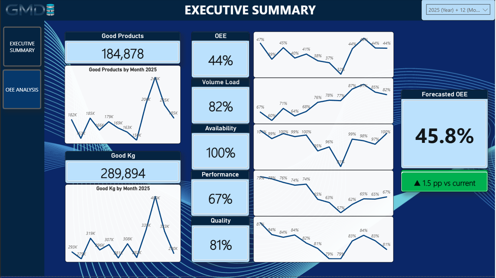
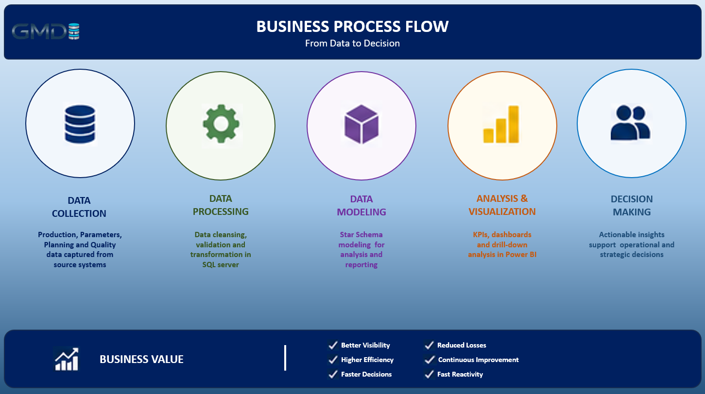
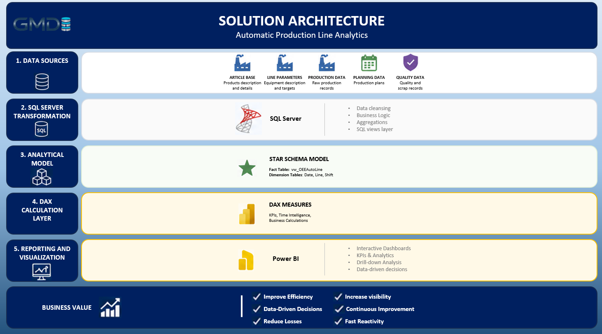
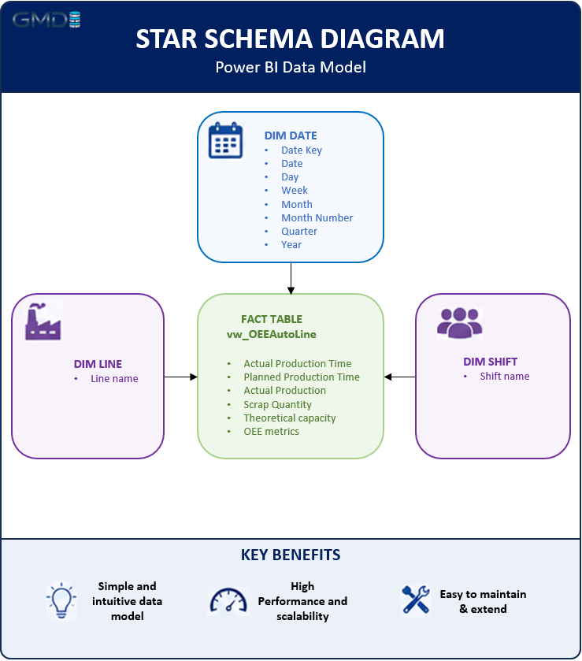
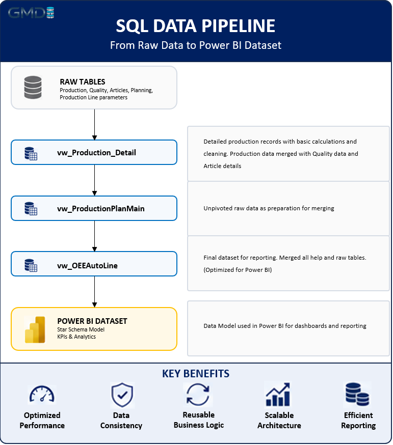
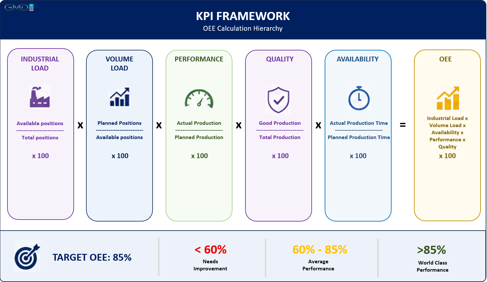
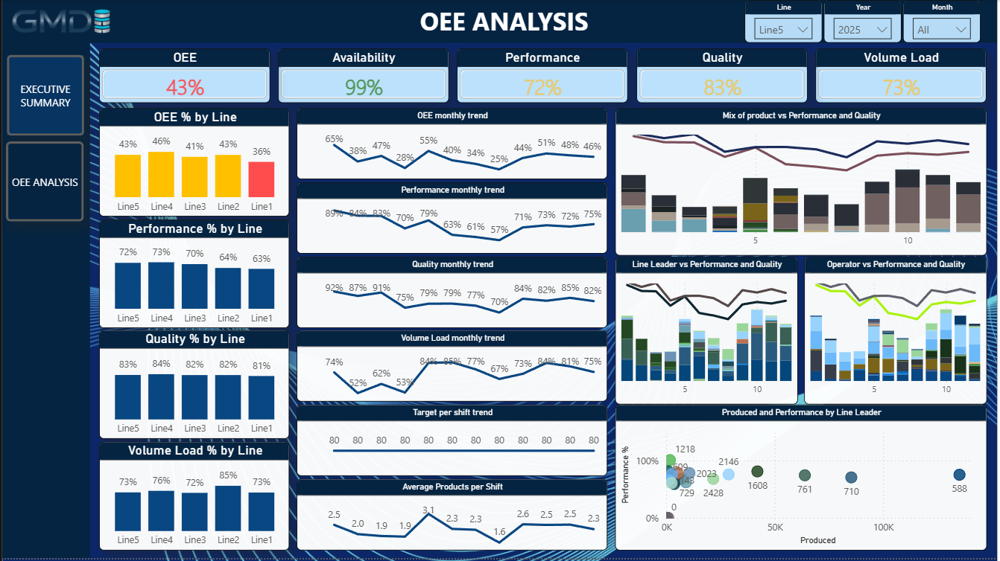
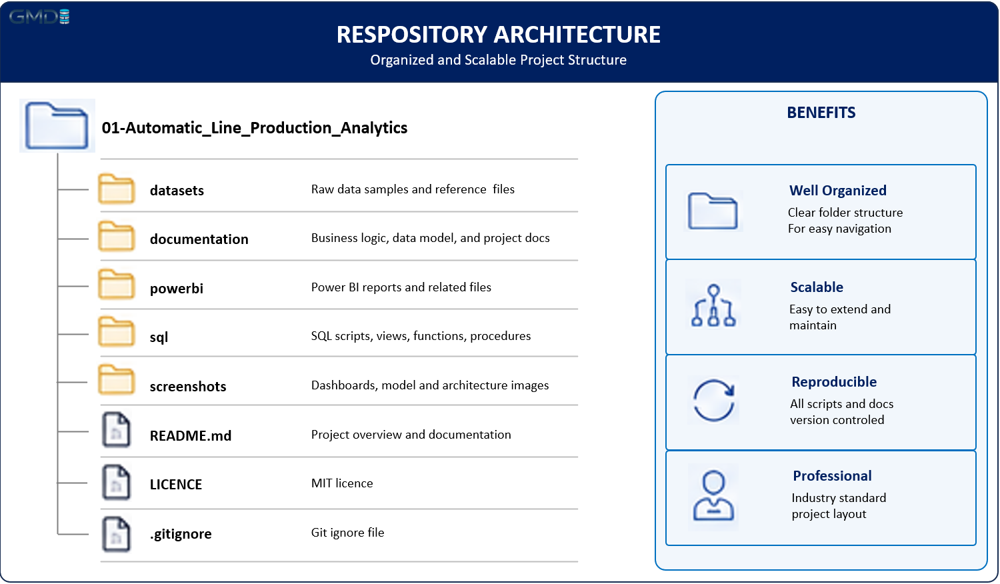

# 🚀 Automatic Production Line Analytics

### End-to-End Manufacturing Business Intelligence Solution

This project demonstrates the development of a complete Business Intelligence solution for monitoring and analyzing automated casting production lines. 
The solution transforms raw production, planning, and quality data into actionable business insights using SQL Server and Power BI.

The primary objective is to measure Overall Equipment Effectiveness (OEE), monitor production performance, identify operational bottlenecks, and support data-driven decision-making.

---

# 📷 Dashboard Preview

---

# 📌 Project Overview

Manufacturing companies generate thousands of production records every day. Without a structured analytical solution, it becomes difficult to monitor equipment efficiency, 
compare planned versus actual production, identify quality losses, and support operational decision-making.

This project delivers a complete Manufacturing Analytics solution that integrates production, planning, and quality data into a unified analytical model. 
The solution provides interactive dashboards for monitoring production performance and Overall Equipment Effectiveness (OEE).

---

# 🎯 Business Objectives

The solution was designed to answer the following business questions:

- What is the current OEE of each production line?
- Which production lines are performing below target?
- How does actual production compare to the production plan?
- Which production teams achieve the highest efficiency?
- What are the current production trends?
- How efficiently is available production capacity being utilized?

---

# 🏭 Business Process

---

# ⚙ Technology Stack

| Layer | Technology |
|--------|------------|
| Database | SQL Server |
| Data Preparation | SQL Views |
| ETL | Power Query |
| Data Modeling | Star Schema |
| Analytics | DAX |
| Visualization | Power BI |
| Version Control | Git & GitHub |

---

# 🏗 Solution Architecture

---

# 🗂 Data Model

---

# 🔄 SQL Data Pipeline

---

# 📊 KPI Framework

Additional KPIs include:

- Production Quantity
- Scrap
- Forecast KPI

---

# 📈 Dashboard Pages

## Executive Summary

Provides an executive overview of manufacturing performance through KPI cards, trend analysis, forecasting, and production monitoring.

**Main Features**

- KPI Cards
- Production Trends
- Forecast
- Capacity Monitoring
- Interactive Slicers

---

## OEE Analysis

Detailed analysis of production efficiency across production lines, shifts, and time periods.

**Main Features**

- OEE Analysis
- Availability
- Performance
- Quality
- Monthly Trends
- Drill-down Analysis

---

# 🔍 Key Findings

> **Summarize the most important insights identified during the analysis.**

*(To be completed based on the final dashboard results.)*

---

# 💡 Business Recommendations

> **Provide practical recommendations that management can implement based on the analytical findings.**

*(To be completed based on the final dashboard results.)*

---

# 💼 Business Impact

The implemented solution enables:

- Daily production monitoring
- OEE measurement
- Capacity utilization analysis
- Production planning comparison
- Scrap monitoring
- Executive reporting
- Faster operational decision-making
- Continuous improvement initiatives

---

# ⭐ Technical Highlights

- End-to-End Business Intelligence Solution
- SQL Server Data Transformation
- Modular SQL View Architecture
- Star Schema Data Modeling
- Advanced DAX Measures
- Manufacturing KPI Framework
- Forecast Analytics
- Interactive Power BI Dashboards
- Professional UI Design
- Manufacturing Analytics Best Practices

---

# 📂 Repository Structure

---

# 📚 Documentation

Additional project documentation is available in the **Documentation** folder.

Included documentation:

- Project Architecture
- Business Logic
- SQL Documentation
- Data Model
- Power BI Documentation
- DAX Measures

---

# 🚀 Future Improvements

Possible future enhancements include:

- Power BI Service Deployment
- Automated Data Refresh
- Near Real-Time Reporting
- Predictive Maintenance
- Machine-Level Drill-through
- AI-assisted Production Forecasting

---

# 👨‍💻 About the Author

**Miroslav Grujic - GM Data Insight**

Manufacturing Data Analytics | SQL Server | Power BI | Operations Analytics

With 18 years of experience in the automotive industry, this project combines manufacturing expertise with modern Business Intelligence practices to deliver actionable operational insights.

---

# 📄 License

This project is licensed under the MIT License.

---

⭐ If you found this project interesting, feel free to explore the other projects available in my **GM Data Analytics Portfolio**.