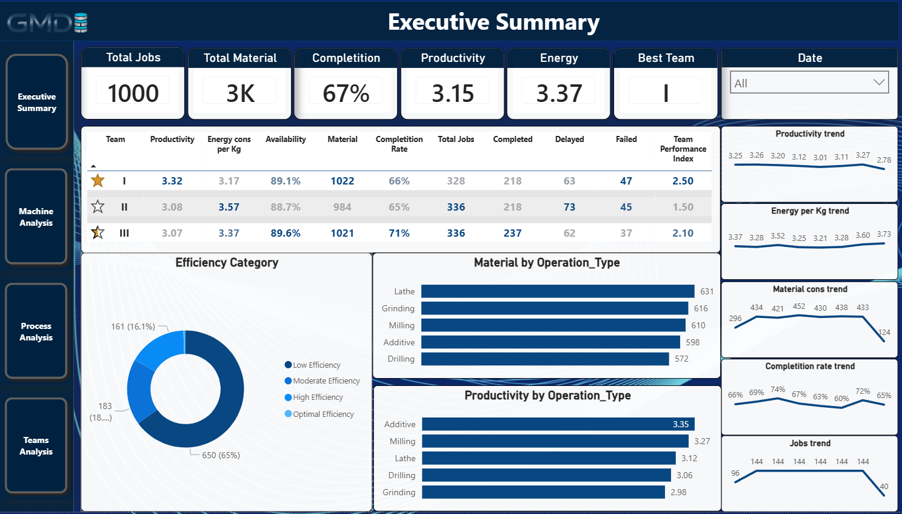

# Manufacturing Operations Performance Analytics Dashboard



### Project Overview #####

This project demonstrates the development of a Manufacturing Operations Performance Analytics Dashboard using Power BI.
The objective was to transform raw manufacturing production data into actionable business insights through data modeling, KPI development, and interactive reporting.
The solution was designed to help production managers and operations teams monitor equipment effectiveness, production efficiency, resource utilization, and operational performance.
Using a Star Schema data model, DAX calculations and Power Query, the dashboard provides visibility into key manufacturing metrics including productivity, completion rates, 
material consumption, and energy efficiency on shift basis.
The final solution consists of four analytical report pages:

* Executive Summary
* Machine Analysis
* Process Analysis
* Teams Analysis


### Technologies Used ####

* Power BI
* Power Query
* DAX
* Data Modeling
* Star Schema Design
* Manufacturing KPI Framework

### Project Objectives ####

* Monitor manufacturing performance through KPIs
* Analyze machine utilization and effectiveness
* Analyze teams strong points and points to improve
* Track productivity and operational efficiency
* Support data-driven decision making
* Improve visibility across manufacturing operations

### Business Problem ####

Manufacturing companies generate large amounts of operational data from production processes, machines, and work orders. However, this data is often dispersed 
across multiple systems and reports, making it difficult for management to gain a clear view of operational performance.
Without a centralized analytics solution, production managers face several challenges:

* Limited visibility into machine effectiveness and utilization
* Difficulty identifying production bottlenecks
* Inconsistent monitoring of key manufacturing KPIs
* Delayed detection of productivity issues
* Poor visibility into energy consumption and resource efficiency
* Time-consuming manual reporting processes

As a result, decision-making becomes reactive rather than proactive, reducing overall operational efficiency and limiting opportunities for continuous improvement.

### Solution ####

To address these challenges, a Power BI analytics solution was developed to consolidate manufacturing data into a single performance management dashboard.
The solution provides:

* Standardized KPI monitoring
* Productivity and performance analysis
* Monitoring trend analysis
* Material and energy consumption tracking
* Executive-level operational reporting

By transforming raw production data into actionable insights, the dashboard enables management teams to identify improvement opportunities, 
monitor operational performance, and support data-driven decision making.


### Dataset Description ####

The project uses a Hybrid Manufacturing Dataset representing production activities across multiple machines and work orders.
The dataset contains operational information related to production execution, processing times, material consumption, energy usage, and production status.


### Fact Table ####

#### Fact_Production ####

The central fact table stores production-level transactions and operational metrics.
Key attributes include:

| Field                   | Description                                 |
| ----------------------- | ------------------------------------------- |
| Job_ID                  | Unique production job identifier            |
| Machine_ID              | Machine responsible for production          |
| Operation Type          | Types of process                            |
| Material_Used           | Quantity of material processed              |
| Processing_Time         | Planned running minutes                     |
| Energy_Consumtion       | Energy consumed during production           |
| Machine Availability    | Machine Availability given by client        |
| Scheduled_Start         | Planned production start time               |
| Scheduled_End           | Planned production finish time              |
| Actual_Start            | Actual production start time                |
| Actual_End              | Actual production finish time               |
| Job Status              | Production status (Completed/Delayed/Fail)  |
| Optimization Category   | High / Low / Moderate Efficiency            |  

Additional calculated columns were created to support KPI calculations:

| Field                   | Description                                                                                  |
| ----------------------- | -------------------------------------------------------------------------------------------- |
| Actual_Processing_Time  | Actual machine running in h                                                                  |
| Productivity (Kg/H)     | As there are no quantified product units, calculation is based on Kg of material used per h  |
| Energy per Kg           | To quantify financial impact of energy cons, calculation is based on Kwh per kg produced     |
| Energy per h            | To quantify pure machine energy performance, calculation is based on Kwh per actual h        |
| Process status          | Status Completed/In Progress                                                                 |
| Start Delay             | Calculation of start delay in h                                                              |
| End Delay               | Calculation of end delay in h                                                                |
| Team                    | Preparation for comparation of results per shift                                             |

### Dimension Tables ###

#### Dim_Date ####

The Date dimension was created to support time-based analysis and trend reporting.
Key fields include:

* Date
* Year
* Month
* Month Name
* Week

#### Dim_Machine ####

The Machine dimension was created to support machine-level performance analysis.
Key fields include:

* Machine_ID

### Dataset Purpose ####

The dataset was structured to support manufacturing performance analysis through a Star Schema model, enabling efficient reporting and KPI calculation within Power BI.


### Data Model ####


A Star Schema data model was implemented to ensure efficient reporting, simplified relationships, and scalable KPI calculations.
The model consists of one fact table and two dimension tables.

### Data Model Structure ####

### Fact Table ####

#### Fact_Production ####

The Fact_Production table serves as the central transactional table containing production records and operational metrics.
The table stores:

* Production jobs
* Processing times
* Material consumption
* Energy consumption
* Production status
* Productivity metrics

This table is the primary source for all KPI calculations and dashboard visualizations.

### Dimension Tables ####

#### Dim_Date ####

The Date dimension provides a dedicated calendar structure for time intelligence and trend analysis.

Benefits:

* Monthly performance reporting
* Trend analysis
* Time-based KPI tracking
* Consistent date filtering

#### Dim_Machine

The Machine dimension provides machine-level context for operational analysis.

Benefits:

* Machine performance comparison
* Productivity analysis
* Equipment effectiveness monitoring
* Operational benchmarking

### Relationships

| From Table  | To Table        | Relationship |
| ----------- | --------------- | ------------ |
| Dim_Date    | Fact_Production | 1 : *        |
| Dim_Machine | Fact_Production | 1 : *        |

Both relationships use a single-direction filter flow from dimension tables to the fact table.

### Modeling Approach

The Star Schema approach was selected because it:

* Improves report performance
* Simplifies DAX calculations
* Reduces model complexity
* Supports scalable dashboard development
* Follows Power BI modeling best practices

This structure enables efficient KPI calculations and provides a strong foundation for manufacturing analytics and operational reporting.


## KPI Framework

The dashboard was designed around a manufacturing performance KPI framework focused on productivity, 
operational efficiency, resource utilization, and production execution.
The following KPIs are used throughout the dashboard pages.

### Productivity

Measures the material processed in Kg vs hours invested.

**Purpose**

* Main KPI which should represent major operational efficiency
* Compare performance across machines, teams, and processes
* Identify improvement opportunities


**Used In**

* Executive Summary
* Machine Analysis
* Teams Analysis
* Process Analysis

---

### Availability

Raw data given by client. Represents machine actvie time vs available time.

**Purpose**

* Evaluate equipment utilization
* Identify downtime impact
* Support production planning

**Used In**

* Executive Summary
* Machine Analysis
* Teams Analysis
* Process Analysis

---

### Completion Rate

Measures the percentage of successfully completed production jobs comparing to schedule plan.

**Purpose**

* Evaluate operational execution
* Monitor production reliability
* Track teams execution skills and efficiency

**Used In**

* Executive Summary
* Teams Analysis
* Process Analysis

---

### Total Jobs

Represents the total number of production jobs processed during the selected period.

**Purpose**

* Measure production workload
* Analyze operational throughput
* Support capacity evaluation

**Used In**

* Executive Summary
* Machine Analysis

---

### Total Material

Represents the total quantity of material processed.

**Purpose**

* Measure production volume
* Analyze material utilization
* Compare process demand

**Used In**

* Executive Summary
* Process Analysis

---

### Energy per Kg

Measures energy efficiency by relating energy consumption to processed material quantity.

**Purpose**

* Benchmark operational efficiency
* Compare machines, teams, and processes
* Identify optimization opportunities

**Used In**

* Executive Summary
* Machine Analysis
* Teams Analysis
* Process Analysis

---

### Team Performance Index

A composite metric used to compare team effectiveness based on 
productivity, availability, energy consumption and completion performance.

**Purpose**

* Rank team performance
* Identify top-performing teams
* Support workforce optimization

**Used In**

* Executive Summary
* Teams Analysis

---

### Efficiency Categories

Production records are grouped into efficiency levels to support performance segmentation.

Categories include:

* High Efficiency
* Moderate Efficiency
* Low Efficiency

**Purpose**

* Quickly identify operational performance distribution
* Highlight improvement opportunities
* Support management reporting

**Used In**

* Executive Summary
* Teams Analysis
* Process Analysis

---

### Trend KPIs

Several trend indicators are used throughout the dashboard to monitor performance over time.

Tracked trends include:

* Productivity Trend
* Energy per Kg Trend
* Material Consumption Trend
* Completion Rate Trend
* Jobs Trend

**Purpose**

* Detect performance changes
* Monitor operational stability
* Support continuous improvement initiatives

**Used In**

* Executive Summary
* Teams Analysis
* Process Analysis


## Dashboard Pages

The Power BI solution consists of four interactive report pages designed to provide visibility into 
manufacturing performance from different operational perspectives.

---

### Executive Summary

The Executive Summary page provides a high-level overview of manufacturing operations and key performance indicators.

#### Key Metrics

* Total Jobs
* Total Material Processed
* Completion Rate
* Productivity
* Energy per Kg
* Best Performing Team

#### Key Analysis

* Team performance comparison
* Productivity trends
* Energy efficiency trends
* Material consumption trends
* Completion rate trends
* Efficiency category distribution
* Production volume by operation type
* Productivity by operation type

#### Business Value

This page enables management to quickly assess overall operational performance, identify top-performing teams, identify improvement points, 
and monitor key manufacturing trends.

---

### Machine Analysis

The Machine Analysis page focuses on machine-level operational performance and efficiency.

#### Key Metrics

* Total Jobs
* Availability
* Average Productivity
* Energy per Kg

#### Key Analysis

* Productivity by machine
* Availability by machine
* Job completion performance
* Top performing machine-process combinations
* Lowest performing machine-process combinations
* Energy consumption by machine

#### Business Value

This page helps identify high-performing and underperforming machines, supporting maintenance planning, capacity optimization, planning optimization
and operational improvement initiatives.

---

### Teams Analysis

The Teams Analysis page evaluates production team performance across key operational metrics.

#### Key Metrics

* Productivity
* Availability
* Completion Rate
* Energy per Kg

#### Key Analysis

* Team efficiency comparison
* Productivity by team / process combination
* Energy efficiency by team / machine combination
* Productivity trends by team
* Energy trends by team
* Process-level performance within each team

#### Business Value

This page supports workforce performance analysis, identifies best-performing teams, and highlights opportunities for productivity improvements and employee training planification.


---

### Process Analysis

The Process Analysis page provides detailed insights into operational performance across manufacturing processes.

#### Key Metrics

* Productivity
* Availability
* Completion Rate
* Energy per Kg

#### Key Analysis

* Process efficiency comparison
* Productivity by process
* Energy efficiency by process
* Productivity trends by process
* Energy consumption trends by process
* Process completion performance

#### Business Value

This page enables management to evaluate process effectiveness, identify operational bottlenecks, and optimize resource utilization across manufacturing operations.

---

### Interactive Features

The dashboard includes interactive filtering and navigation capabilities:

* Cross-filtering between visuals
* Date-based analysis
* Drill-down capabilities
* Dynamic KPI calculations
* Multi-page navigation

These features allow users to explore operational performance from executive, machine, team, and process perspectives.


## Key Findings

The analysis revealed several important operational insights across machines, teams, and manufacturing processes.

### 1. Team I Demonstrated the Highest Overall Performance

Team I achieved the highest productivity level while maintaining strong completion rates and competitive energy efficiency.
On the other hand, each team excelled in productivity on some process, and energy on some of machines.
This indicates that there is specific technical and organizational knowledge in each team which could be future best practice base.

---

### 2. Significant Productivity Differences Exist Across Manufacturing Processes

Additive process achieved the highest productivity levels, while Grinding showed lower productivity performance which dropped 4 days ago and still on low level.
This suggests opportunities for process optimization and further investigation into operational constraints affecting lower-performing processes.

---

### 3. Machine Performance Varies Considerably

Productivity analysis showed noticeable differences between machines, with some machine-process combinations significantly outperforming others.
In term of completition rate, there is indication of technical issues with some of the machines.
This variation indicates opportunities to standardize operating procedures and improve machine utilization and maintenance.

---

### 4. Energy Efficiency Differs Across Teams and Processes

Energy consumption per kilogram varied between teams and manufacturing processes.
These differences suggest that operational practices, machine utilization, and process characteristics have a direct impact on energy efficiency.

---

### 5. Completion Rates Indicate Opportunities for Operational Improvement

While the overall completion rate remained above 70%, delayed and failed jobs continue to impact operational performance.
Reducing delays and improving job execution could significantly increase overall manufacturing efficiency.

---

### 6. Process-Level Trend Analysis Revealed Performance Fluctuations

Several manufacturing processes showed fluctuations in productivity and energy consumption over time.
Continuous monitoring of these trends can help identify emerging operational issues before they impact overall performance.

---

### 7. Operational Performance Benefits from Multi-Dimensional Analysis

Combining machine, team, and process perspectives provided a more comprehensive understanding of manufacturing performance than any single metric alone.
This demonstrates the value of an integrated manufacturing analytics approach.


## Business Recommendations

Based on the analysis of manufacturing operations, several improvement opportunities were identified.

### 1. Replicate Best Practices from High-Performing Teams

**Recommendation:**

* Analyze workflows used by Team I.
* Examine operating practices of Team I on Milling and Drilling process.
* Examine operating practices of Team II on Additive process.
* Standardize successful operating practices.
* Share best practices across production teams.

**Expected Benefit:**

Improved productivity and operational consistency across the workforce.

---

### 2. Investigate Low-Productivity Processes

Certain manufacturing processes showed lower productivity levels than others.

**Recommendation:**

* Compare process workflows between Additive and Grinding in term of productivity (speed, complexity).
* Evaluate machine setup and process execution procedures between Lathe and Additive.
* Identify gaps and go towards equalization as much as possible. 
* Identify issue on 2023-03-22 on grinding process.
* Identify issue on 2023-03-23 on lathe process.
* Identify improvement on 2023-03-23 on Drilling process and standardize it.
* Identify workflow on 2023-03-24 on additive process and standardize it.

**Expected Benefit:**

Higher throughput, improved resource utilization and achiveable planification of production.

---

### 3. Investigate machine-process combinations performance

**Recommendation:**
**Short term **
* Plan Drilling process on M01 machine / avoid M02
* Plan Grinding process on M02 machine / avoid M04
* Plan Milling process on M03 machine
* Plan Additive process on M04 machine / avoid M01
* Plan lathe process on M05 machine / avoid M01

**Middle Term**
* Standardize processes between machines according to best practice

**Expected Benefit:**

Higher productivity and energy consumption performance.

---

### 4. Optimize Energy Efficiency

Energy consumption per kilogram varies across teams and processes.

**Recommendation:**

* Benchmark M02 regarding energy efficiency (spare parts, connections, speed, resistance)
* Benchmark Team2 efforts for energy performance in last 4 days. 
* Implement energy optimization initiatives

**Expected Benefit:**

Lower operational costs and improved sustainability performance.

---

### 5. Improve completion rates

Completion rates are above 70% in global and no significant difference between teams, machines or procesess.

**Recommendation:**

* Review planification of production.
* Review and improve preparation and startup procedure for all procesess and equipment 

**Expected Benefit:**

Lower operational costs and improved sustainability performance.

---

### 6. Track perofrmance on daily basis

Analysis revealed significant trend fluctuations in all KPIs.

**Recommendation:**

* Organize daily routine for review and quick action for each KPI.
* Inform production teams about results on daily basis

**Expected Benefit:**

Result oriented and competitive teams bring biggest impact on performance.

---

### 7. Expand Operational Performance Monitoring

The dashboard demonstrates the value of integrated manufacturing analytics.

**Recommendation:**

Future versions could incorporate:

* Downtime tracking
* Root cause analysis
* Predictive maintenance indicators
* Quality performance metrics
* Production forecasting

**Expected Benefit:**

Enhanced decision-making capabilities and greater operational visibility.


## Skills Demonstrated

This project demonstrates practical experience in the following areas:

### Business Intelligence

* KPI Development
* Performance Analytics
* Operational Reporting
* Executive Dashboard Design
* Data-Driven Decision Making

### Power BI

* Interactive Dashboard Development
* Report Design and Visualization
* Drill-Down Analysis
* Cross-Filtering
* Performance Optimization

### Data Modeling

* Star Schema Design
* Fact and Dimension Modeling
* Relationship Management
* Data Transformation

### DAX

* KPI Calculations
* Aggregation Measures
* Ratio Metrics
* Time-Based Analysis
* Custom Performance Indicators

### Manufacturing Analytics

* Productivity Analysis
* Availability Monitoring
* Resource Utilization Analysis
* Energy Efficiency Monitoring
* Process Performance Evaluation

### Data Preparation

* Power Query Transformations
* Data Cleansing
* Feature Engineering
* Calculated Columns Creation


## Project Files

### Power BI

Contains the Power BI report file used to build the dashboard and KPI framework.

```text
Power_BI/
└── Manufacturing_Operations_Performance_Analytics.pbix
```

### Screenshots

Contains dashboard screenshots used for project presentation and documentation.

```text
ScreenShots/
├── executive-summary.png
├── machine-analysis.png
├── teams-analysis.png
└── process-analysis.png
```

### Dataset

Contains the manufacturing dataset used for the project.

```text
DataSets/
└── hybrid_manufacturing_dataset.xlsx
```

### Documentation

Contains supporting project documentation and business analysis materials.

```text
Documentation/
└── project-documentation.pdf
```


## Screenshots Gallery

### Executive Summary


### Machine Analysis


### Teams Analysis


### Process Analysis


	


